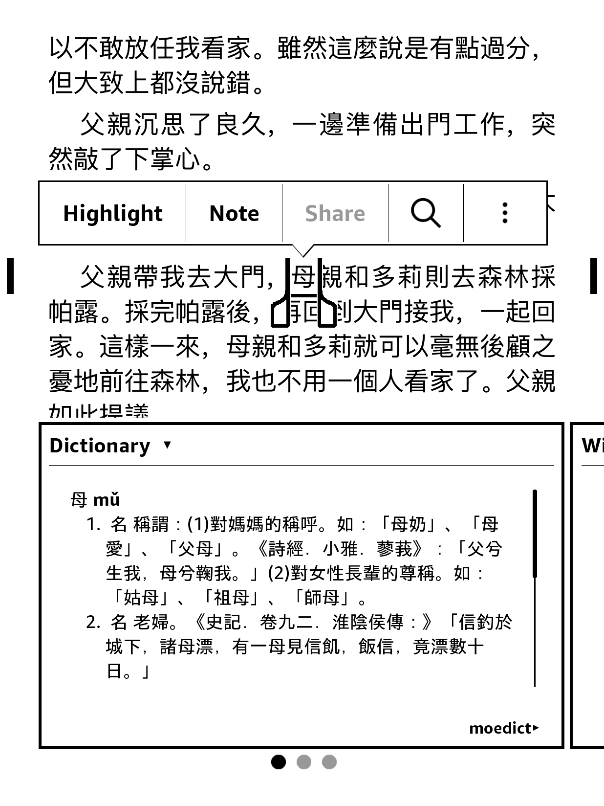

> 👋 Looking to learn traditional Chinese characters? Check out [HanziHero](https://hanzihero.com), a Chinese character learning application that leverages mnemonics and spaced repetition to make learning Chinese characters a breeze. 🎉

# moedict-kindle

moedict-kindle is a traditional Chinese to traditional Chinese Kindle dictionary that uses the data licensed by https://moedict.tw.
To my knowledge, it is the best Chinese-Chinese dictionary that is available in traditional script for Kindle.
(If you are available of any alternatives, paid or otherwise, please let me know.)

Best of all, it is entirely free!

## Usage

1. Download `moedict.mobi` from the latest [release]().
2. Drop it in `documents/dictionaries/` in your Kindle.
3. On Kindle, navigate to `Settings` > `Languages and Dictionaries` > `Dictionaries`
4. Set MOEDICT as the default for Chinese language. 

## License

Same as [moedict-webkit](https://github.com/g0v/moedict-webkit/).

## Development

### Requisites

For Mac, must install Kindle Previewer 3 as this contains `kindlegen` needed for generating the mobi file.

https://www.amazon.com/Kindle-Previewer/b?ie=UTF8&node=21381691011

### Building

1. Run `elixir moedict.exs` to generate `moedict.html`
2. Run `./kindlegen-mac.sh` to generate `moedict.mobi`. If not using Mac, you can simply get `kindlegen` directly and run `kindlegen -c0 output/moedict.opf`.

### Testing/verifying

1. Add `moedict.mobi` to the dictionaries folder in your Kindle.
2. Go to Settings > Languages and Dictionaries > Dictionaries
3. Configure MOEDICT to be the default for Chinese
4. Open up a Chinese-language book with traditional script and try looking things up.

If you need a book to test it on, here's one in public domain: https://www.gutenberg.org/ebooks/24264

### Resources

https://github.com/verenablaschke/kindle-dict

https://kdp.amazon.com/en_US/help/topic/G2HXJS944GL88DNV#html

https://jakemccrary.com/blog/2020/11/11/creating-a-custom-kindle-dictionary/

https://www.mobileread.com/forums/showthread.php?t=346316
